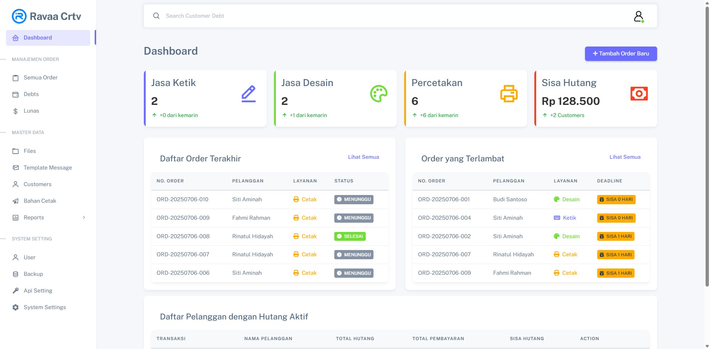
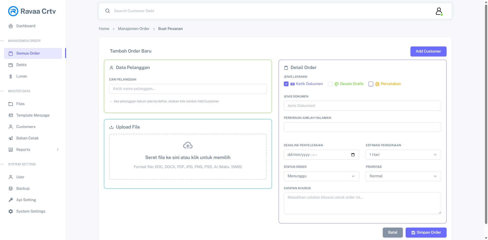
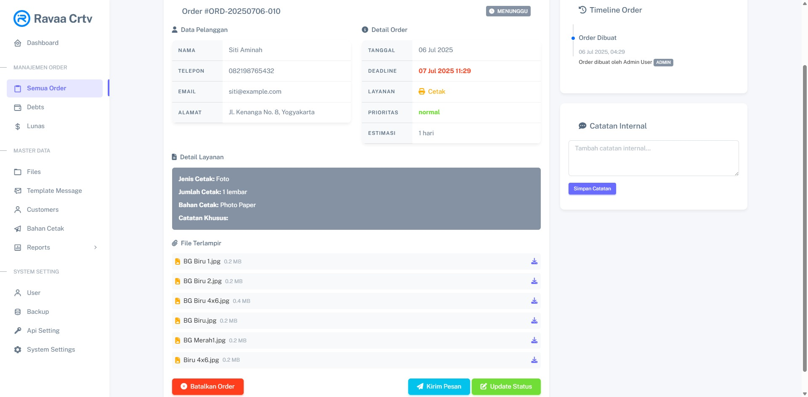
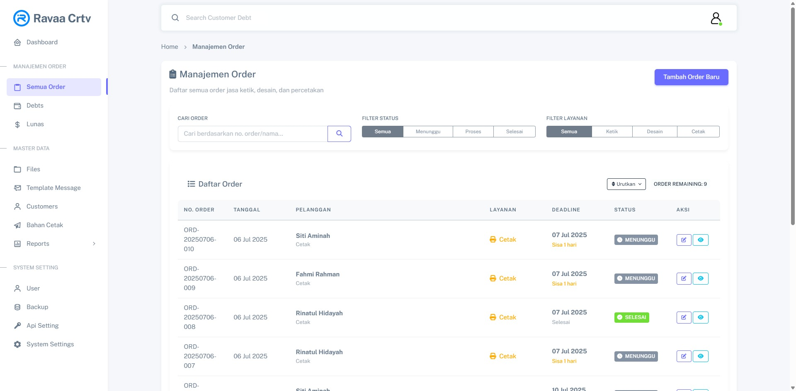

# RC App

**Aplikasi Manajemen Order & Pencatatan Hutang Pelanggan**

RC App adalah aplikasi berbasis Laravel yang dirancang untuk mengelola order layanan cetak, komunikasi WhatsApp otomatis, pengaturan kecepatan layanan, pencatatan file, dan manajemen hutang pelanggan dengan tampilan antarmuka modern dan responsif.

**Berikut Screenshoot dari beberapa tampilan aplikasi RC App**
## Tampilan Aplikasi






---

## ✨ Fitur Utama

- ✅ Manajemen pelanggan dan order cetak (Desain, Print, dll.)
- 📁 Upload & manajemen file per order
- 💬 Template pesan WhatsApp otomatis (order siap, proses, terlambat, batal)
- 📦 Sistem pembaruan aplikasi (manual & auto update)
- 📊 Dashboard & histori lengkap
- 🔐 Hak akses pengguna (Spatie Laravel Permission)
- ⚙️ Panel pengaturan aplikasi

---

## 📦 Instalasi

```bash
git clone https://github.com/kholif18/rc-app.git
cd rc-app
cp .env.example .env
composer install
php artisan key:generate
php artisan migrate --seed
npm install && npm run build
php artisan serve
```

**Catatan:**

- Ubah konfigurasi `.env` sesuai kebutuhan, termasuk `DB_`, `APP_NAME`, `APP_URL`, dan `UPLOAD_MAX_FILESIZE`
- File upload dibatasi maksimal 10MB (atur di `php.ini` dan `.env` jika perlu)

---

## 🧪 Fitur Auto Update

RC App mendukung sistem pembaruan otomatis via tombol "Cek Pembaruan" di admin panel.\
Untuk menggunakan fitur ini:

1. Set `update_url` di tabel `app_settings` ke URL file zip update (misal dari GitHub Releases).
2. Jalankan fitur update di antarmuka admin.

---

## 🛠 Pengembangan

### Struktur Utama

| Folder/File             | Keterangan                                                |
| ----------------------- | --------------------------------------------------------- |
| `app/Http/Controllers/` | Logika aplikasi (OrderController, UpdateController, dll.) |
| `resources/views/`      | Blade template                                            |
| `public/uploads/`       | Folder file yang diupload                                 |
| `database/seeders/`     | Data awal seperti pengaturan, template pesan              |
| `routes/web.php`        | Daftar route aplikasi                                     |

### Seeder Penting

```bash
php artisan db:seed --class=AppSettingSeeder
php artisan db:seed --class=MessageTemplateSeeder
```

---

## 📤 Format Template Pesan

Aplikasi menggunakan template dinamis untuk WhatsApp:

- `order_ready`: Pesanan siap diambil
- `order_progress`: Pesanan sedang diproses
- `order_late`: Pesanan melewati tenggat waktu
- `order_cancelled`: Pesanan dibatalkan

Contoh isi:

```plaintext
Halo [name], pesanan #[order_number] Anda dengan layanan [services] telah selesai dan siap diambil. Silakan ambil sebelum [deadline]. Terima kasih telah menggunakan layanan kami!
```

---

## 🔒 Keamanan & Konfigurasi

- Gunakan HTTPS jika aplikasi dipublikasikan
- Validasi file upload melalui frontend + backend
- Batasi ukuran file melalui `php.ini`, `.env`, dan JavaScript

---

## 💻 Kontribusi

Pull request dan issue sangat diterima! Silakan fork proyek ini dan kirim kontribusimu.

---

## 📃 Lisensi

[MIT License](LICENSE)

---

## ✉️ Kontak

Untuk pertanyaan atau dukungan, hubungi\
📧 [**ravaa.net@gmail.com**](mailto\:ravaa.net@gmail.com)\
🌐 [ravaa.my.id](https://ravaa.my.id)

---

## 🔖 Repositori

GitHub: [https://github.com/kholif18/rc-app](https://github.com/kholif18/rc-app)

